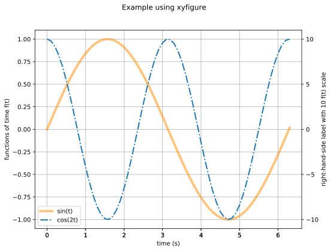
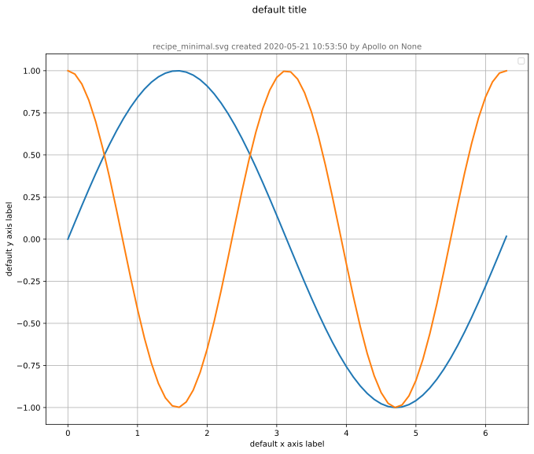

# xyfigure

## Getting Started

Here we create an example data file from an Excel spreadsheet and walk through the steps to create a simple `xyfigure`.

### Workflow

* **Step 1: Data** 
  * Create the example data [file](data.xlsx) in Microsoft Excel.  Here we create a time column `t` (the x-axis), and two functions (two different data series for the y-axis) of time columns `sin(t)` and `cos(2t)`.  
  * Then, from within Excel, export the .xlsx file as a .csv [file](data.csv).
  * *Note:* Generally the data does not come from an Excel file; rather, it will come from the output of a simulation.

* **Step 2: json Recipe**
  * Create the [recipe.json](recipe.json) file, which controls the appearance of the figure.

* **Step 3: Run the recipe on the data**
  * From the folder that contains the json file, run the Python script:
    ```console
    $ cd ~/sibl/io/xyfigure_example/
    $ python ../../xyfigure/client.py recipe.json
    ```

The output file `recipe.svg` contains this figure:



will result, written to the `~/sibl/io/xyfigure_example/` folder.

### Next Steps

* Scan through the [documentation](../../documentation.md). 
* Scan through the [test cases](../../test/README.md).

## Getting Minimalistic

Most of the keywords documented in the [documentation](../../documentation.md) are *optional*.  If the optional keywords are not specified, `xyfigure` selects sensible default values.  Users override the default behaviour by specifying the optional keywords.  

Here is the sine and cosine example from above, as a minimal [json](recipe_minimal.json) file, with only two optional keywords:

* `ycolumn`, to specify the location of the cosine data in the `data.csv` file, and
* `serialize`, to write the generated figure to disc.

Here is the output: 

## Getting More Sophisticated

Here we plot the chess board [image](chess_800_800_px.png)  behind the figure, and override the default tick marks with some specific tick marks.  We also use the alpha channel for a transparent chess board appearance.

The [json](recipe_with_background.json) file results in this figure:


