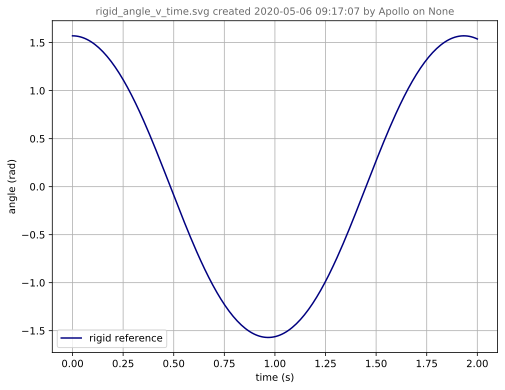
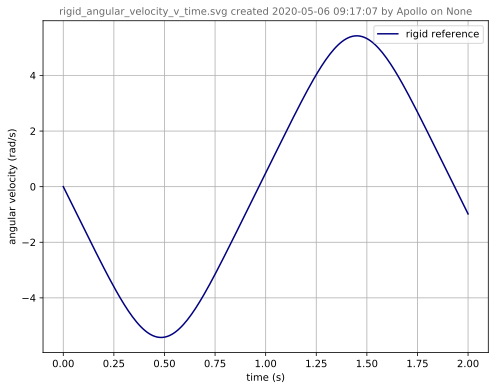
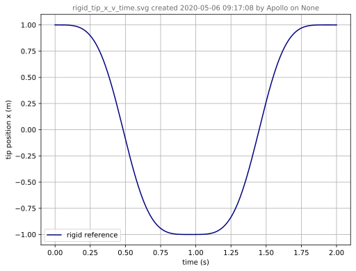
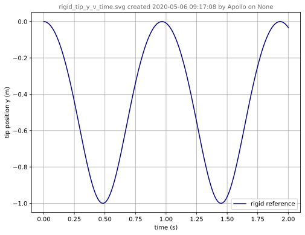
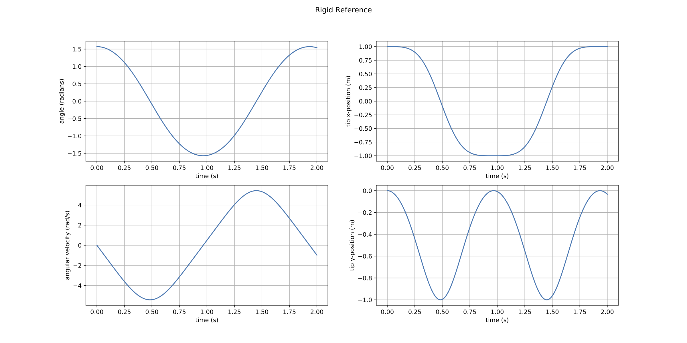
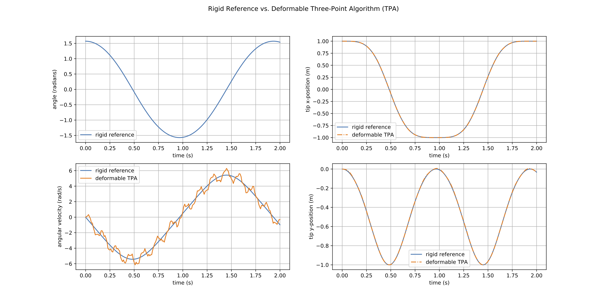

# Three-Point Angular Velocity (TPAV)

## Abstract

Given velocity of three points on a quasi-rigid body, calculate the angular velocity of a quasi-rigid body.

## Methods

The theoretical development is forthcoming, to appear in a SAND report (as of 2020-05-05).

## Verification

### Input

The three-point angular velocity algorithm is applied to a mildly deformable (quasi-rigid) body, and compared to a rigid body dynamics simulation reference.  

* The rigid body reference data is contained in [input/rigid_reference.csv](input/rigid_reference.csv).  
* The deformable body output data from SSM is contained in [input/history.csv](input/history.csv)
  * was created from the /nscratch/chovey/casco_sim/simo/pend-001.i file,
  * has been morphed to [input/pqr_pos_vel.csv](input/pqr_pos_vel.csv), which contains the position and velocity vectors for points **P**, **Q**, and **R**.

    ┌──────────────┐     ┌────────────────┐     ┌─────────────────┐
    │ history.csv  │────▶│ ssm_to_tpav.py │────▶│ pos_vel_pqr.csv │
    └──────────────┘     └────────────────┘     └─────────────────┘

### Output

* The .json file used by XYFigure to post-process the rigid body reference output is [tpav_postpro.json](tpav_postpro.json), which created:

## Reference

The two historical document outputs, from when the tpav code was in the casco_sim repo, are memorialized below:

