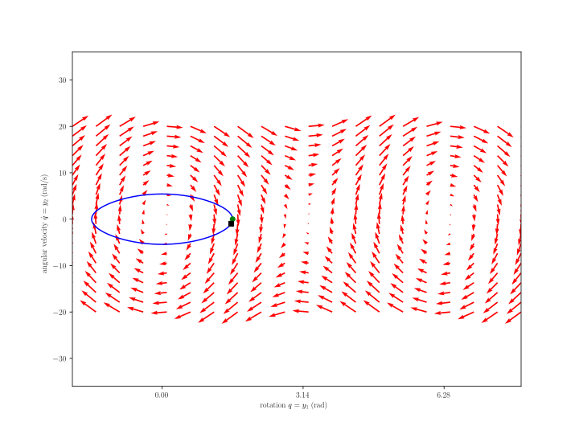

# Three-Point Angular Velocity (TPAV)

## Abstract

Given velocity of three points on a quasi-rigid body, calculate the angular velocity of a quasi-rigid body.

## Methods

The theoretical development is forthcoming, to appear in a SAND report (as of 2020-05-05).

## Verification

## Workflow

* [pendulum_rigid_reference.py](pendulum_rigid_reference.py) integrates the ordinary differential equation governing the rigid pendulum finite rotation motion and outputs the following:
  * [pendulum_rigid_state.csv](pendulum_rigid_state.csv) state variables
  * pendulum_rigid_state.svg state variable figure 
* [history.csv](history.csv) is the output for the quasi-rigid body pendulum simulation from SSM
  * [ssm_to_tpav.py](ssm_to_tpav.py) morphs the history.csv file into the pos_vel_pqr.csv file which 
    * retains only the **P**, **Q**, and **R** positions and velocities, and 
    * reorders them per the API of [client.py](client.py), which calls the tpav algorithm contained in [three_points_angular_velocity.py](three_points_angular_velocity.py)
* [pendulum_tpav.py](pendulum_tpav.py) overlays the quasi-rigid tpav results with the rigid baseline results, and outputs the following two files:
  * pendulum_tpav_rigid.svg  
  * pendulum_tpav_deformable.svg  

### Input

The three-point angular velocity algorithm is applied to a mildly deformable (quasi-rigid) body, and compared to a rigid body dynamics simulation reference.  

* The rigid body reference data is contained in [input/rigid_reference.csv](input/rigid_reference.csv).  
* The deformable body output data from SSM is contained in [input/history.csv](input/history.csv)
  * was created from the /nscratch/chovey/casco_sim/simo/pend-001.i file,
  * has been morphed to [input/pqr_pos_vel.csv](input/pqr_pos_vel.csv), which contains the position and velocity vectors for points **P**, **Q**, and **R**.

### Output

* The .json file used by XYFigure to post-process the rigid body reference output is [tpav_postpro.json](tpav_postpro.json), which created:

