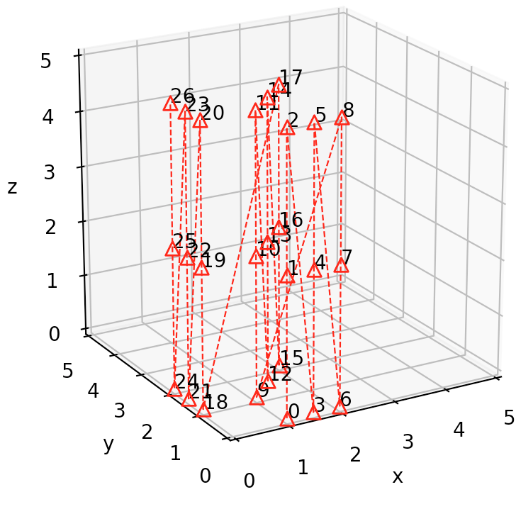
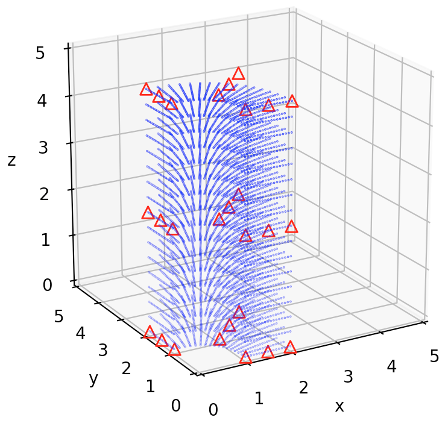
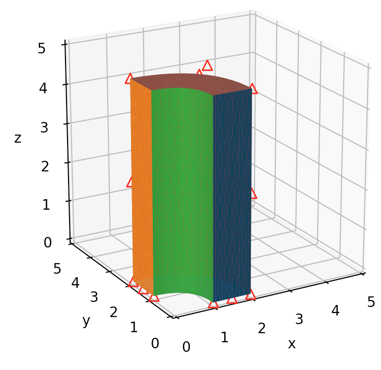

# unit test triquadratic quarter cylinder

## Objective

* Construct an approximation of a quarter cylinder from triquadratic Bezier controls

## Methods

Figure: Surface ordering of contronl points for bilinear face.

Figure: Slice build up in x-direction, each slice is parameterized in (y, z) for a given x.  

Order | Index 
---|:---:
Major | x
Middle | y
Minor | z

Figure: Control point amplification in second and third slice (first slice remains unchanged from prior figure);  x0 face shown in blue, x1 face shown in orange.  

Figure: Excerpt of B-spline control points used by Hughes (see [References](#references) below). Used as inspiration for present Bezier control points. 

### Triquadratic Bezier

* Number of control nets: 1
* Number of control points per net: 27
* Triquadratic Bezier solid
* [points](../data/bezier/triquad-qtr-cyl-control-points.csv)
* [nets](../data/bezier/triquad-qtr-cyl-control-nets.csv)
* [configuration](../data/bezier/triquad-qtr-cyl-config.json)

## Results

Figure: Control points.

Figure: Control nets (only one net is required and thus shown).

Figure: Bezier points (blue) with control points (red).

Figure: Triangulated surface of six faces on Bezier solid, with Bezier solid points (blue).

Figure: Bezier solid with control points (red).

Figure: Bezier solid (top view) with control points (red triangles).

## References

* [Hughes 2005](https://drive.google.com/file/d/0B-0Xwqeen8ddNTNfaHVZal92Mnc/view?usp=sharing) page 4156 and Appendix.
