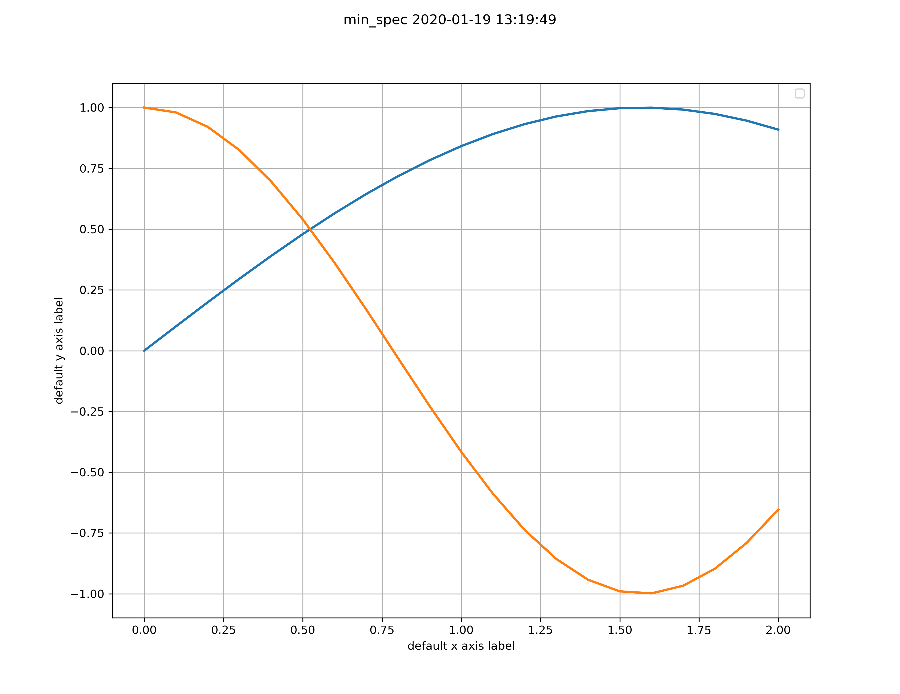
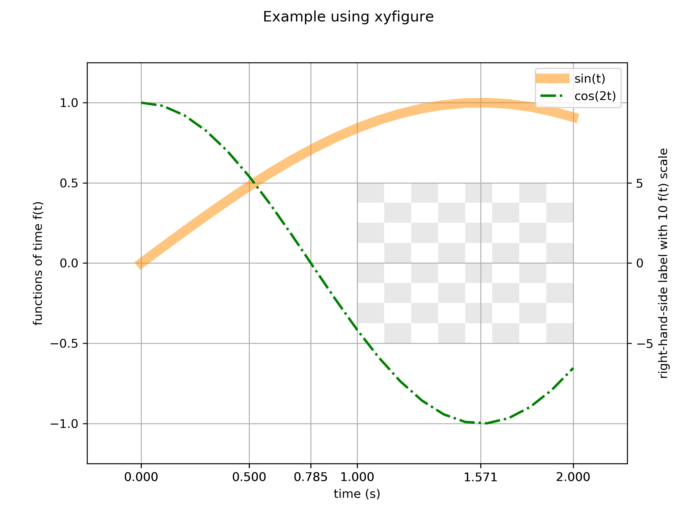

# xyfigure

## Getting Started

Here we create an example data file from an Excel spreadsheet and walk through the steps to create a simple `xyfigure`.

### Workflow

* Create the example data [file](../io/xyfigure_example/t_versus_f_source.xlsx) in Microsoft Excel.  Here we create a time column `t` (the x-axis), and two functions (two different data series for the y-axis) of time columns `sin(t)` and `cos(2t)`.  

> Generally this file does not come from an Excel file; rather, it will come from the output of a simulation.
* Export two `.csv` files as the [sin](../io/xyfigure_example/t_versus_sin_t.csv) and [cos](../io/xyfigure_example/t_versus_cos_2t.csv) files.  
* Create and update the [json](../io/xyfigure_example/figure.json) file, which controls the appearance of the figure.
* From the folder that contains the json file, run the Python script:

```console
$ cd ~/sibl/io/xyfigure_example/
$ python ../../xyfigure/xyfigure.py figure.json
```

The output file `figure_example.png` contains this figure:


will result, written to the `~/sibl/io/xyfigure_example/` folder.

### Next Steps

* Observation:
  * If all data comes from a [single source file](../io/xyfigure_example/t_versus_f_source.xlsx), as in the example above, the workflow can modified to be more efficient.  How?
  * Instead of creating *separate* `.csv` files with `x,y` pairs, create only *one* `.csv` file and specify a non-default `"ycolumn"` value in the `.json` file for the cosine data.
* Exercise: 
  * For the above example, export only *one* `.csv` file with three columns of data, `time,sin(t),cos(2t)` and use `"ycolumn": 2` for the `cos(2t)`.  
  * See the [documentation](documentation.md) for a description of `"ycolumn"`.  
  * Create the same output to verify both workflows produce the same result.
* Scan through the keywords available in the [documentation](documentation.md).
* Scan through the tests in the [test cases](test/README.md).

## Getting Minimalistic

Most of the keywords documented in the [documentation](documentation.md) are *optional*.  If the optional keywords are not specified, `xyfigure` selects sensible default values.  Users override the default behaviour by specifying the optional keywords.  

Here is the sine and cosine example from above, as a minimal [json](../io/xyfigure_example/min_spec.json) file, without any optional keywords:

```json
{
    "sine-data": {
        "class": "model",
        "folder": ".",
        "file": "t_versus_sin_t.csv"
    },
    "cosine-data": {
        "class": "model",
        "folder": ".",
        "file": "t_versus_cos_2t.csv"
    },
    "figure-output": {
        "class": "view",
        "folder": ".",
        "file": "min_spec.png"
    }
}
```

Here is the output that will be shown to the screen (your date and time stamp in the title will be different, to reflect when you created the image):



## Getting More Sophisticated

Here we plot the chess board [image](../io/xyfigure_example/chess_800_800_px.png)  behind the figure, and override the default tick marks with some specific tick marks.  We also use the alpha channel for a transparent chess board appearance.

The [json](../io/xyfigure_example/figure_with_background.json) file results in this figure:


