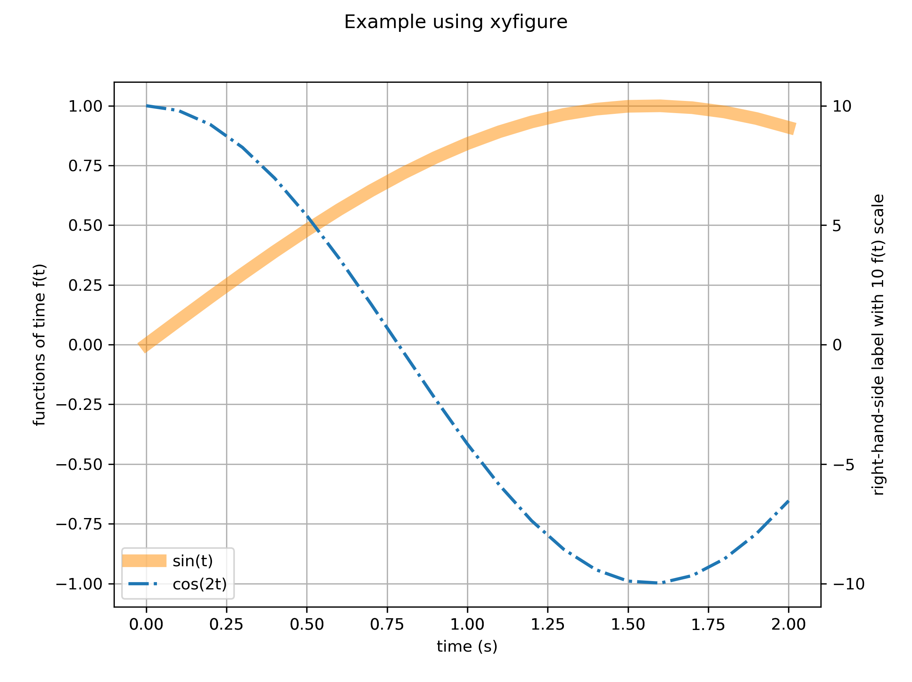

# Getting Started

Here we create an example data file from an Excel spreadsheet and walk through the steps to create a simple `xyfigure`.

* Create the example data [file](../io/xyfigure_example/t_versus_f_source.xlsx) in Microsoft Excel.  Here we create a time column `t` (the x-axis), and two functions (two different data series for the y-axis) of time columns `sin(t)` and `cos(2t)`.  

> Generally this file does not come from an Excel file; rather, it come from the output of a simulation.
* Export two `.csv` files as for the [sin](../io/xyfigure_example/t_versus_sin_t.csv) and [cos](../io/xyfigure_example/t_versus_cos_2t.csv) files.
* Create and update the [json](../io/xyfigure_example/figure.json) file, which controls the appearance of the figure.
* From the folder that contains the json file, run the Python script:

```console
$ cd ~/sibl/io/xyfigure_example/
$ python ../../xyfigure/client.py figure.json
```

The resulting figure, `figure_exmaple.png`, 



will result, written to the `~/sibl/io/xyfigure_example/` folder.

For more information on the variations that are possible for formatting, see the [XYfigure_defaults.json](XYFigure_defaults.json) file.
