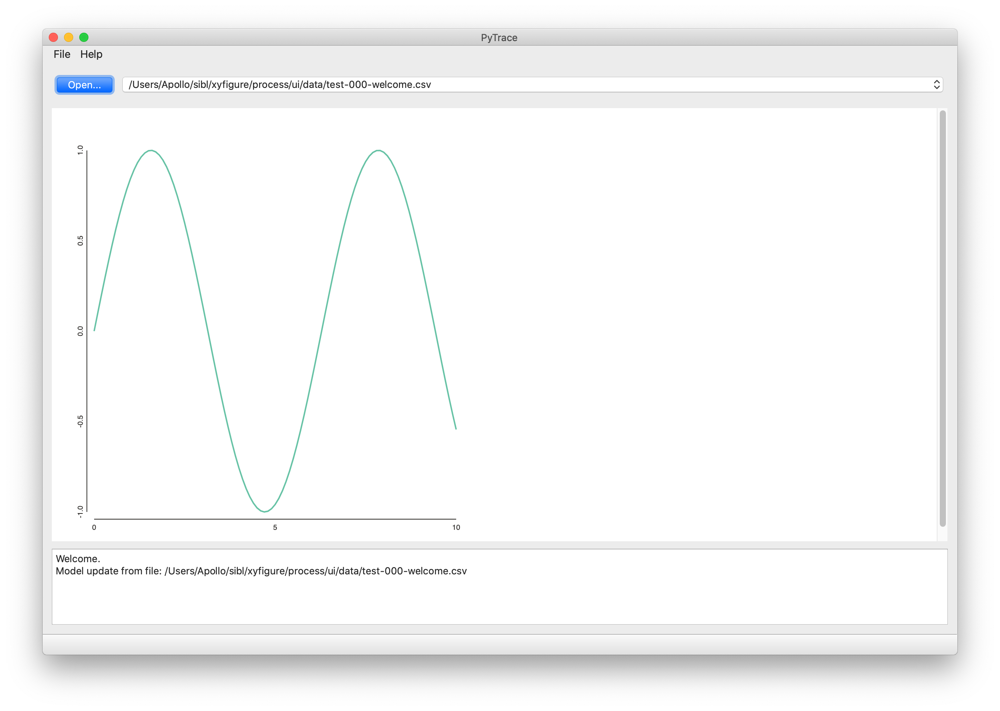
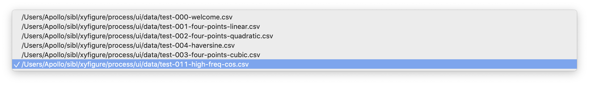
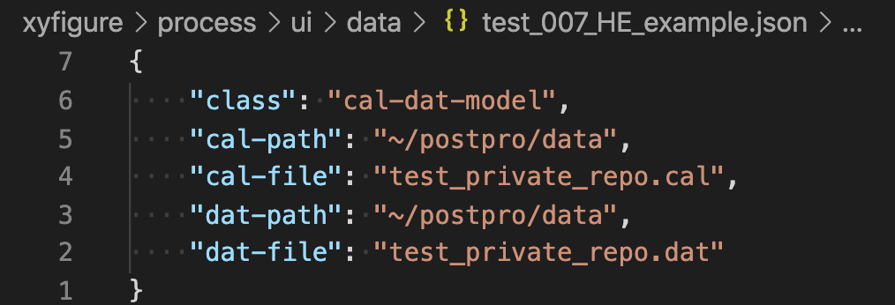

# Front End Use

## Qt versus Dash

* Qt
  * Desktop app for Windows, Mac, Linux
  * Traditional
* Dash
  * Web app for any platform with a browser
  * Python wrapping of Javascript
  * Interactive

## Qt `PyTrace`

* Self-test on start up 
* 
* Overview
* 
* Context switching 
* 
* Error check and feeback
* 
* Private data
* 

```bash
$ (base) conda activate siblenv
$ (siblenv) pip install --user pycaldat-0.0.n-py3-non-any.whl  # where n is the version number
```

## Dash app

To come.
