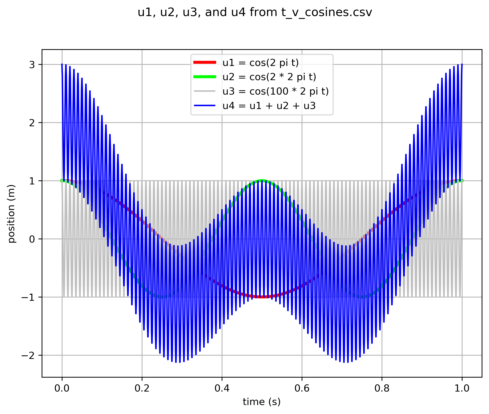
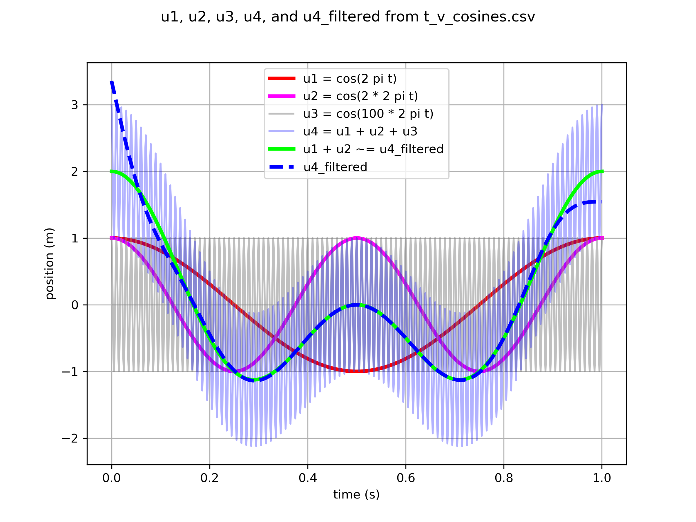
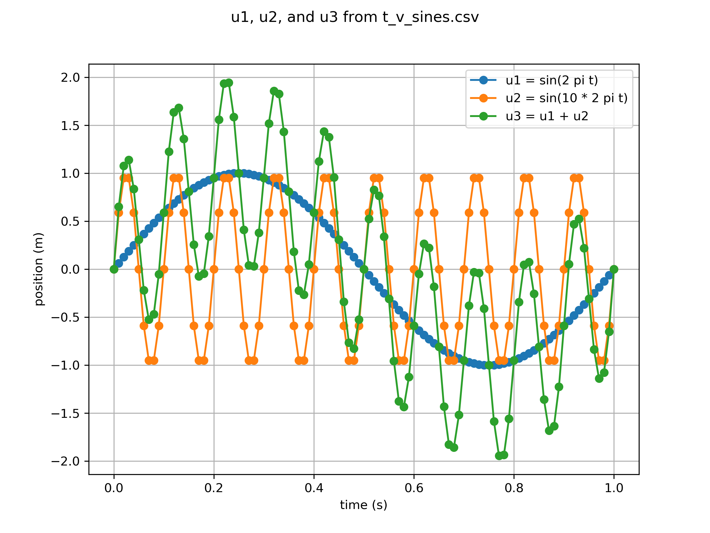
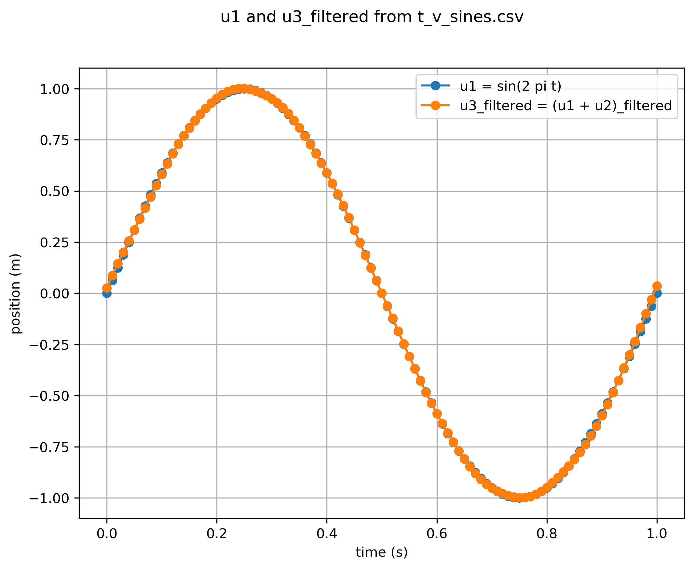

# Test Cases

## General

### Image Same or Different

* The .png output figure from [t_v_half_u_squared_test.json](t_v_half_u_squared_test.json) was renamed to image_diff_test.png:

* A duplicate image was then created as image_diff_test_clone.png:

* A final modified image image_diff_test_diff.png was created:

The test script [image_diff_test.py](image_diff_test.py) is then used to assess same or different status.

## Signal Processing

### Differentiation

#### Quadratic Function as Source

* source signal with
[t_v_half_u_squared_test.json](t_v_half_u_squared_test.json):

* first derivative with
[t_v_half_u_squared_test_ddt1.json](t_v_half_u_squared_test_ddt1.json):

* second derivative with
[t_v_half_u_squared_test_ddt2.json](t_v_half_u_squared_test_ddt2.json):

* third derivative with
[t_v_half_u_squared_test_ddt3.json](t_v_half_u_squared_test_ddt3.json):

#### Sine Function as Source

* source signal with
[t_v_sines.json](t_v_sines.json):

* first derivative with
[t_v_sines_ddt1.json](t_v_sines_ddt1.json):

### Butterworth Filter

* [signal_test.py](signal_test.py) unit test of scipy library
* cosines with [t_v_cosines_prefilter.json](t_v_cosines_prefilter.json):
 and with [t_v_cosines_postfilter.json](t_v_cosines_postfilter.json) 

* sines with [t_v_sines_prefilter.json](t_v_sines_prefilter.json)

and [t_v_sines_postfilter.json](t_v_sines_postfilter.json)

