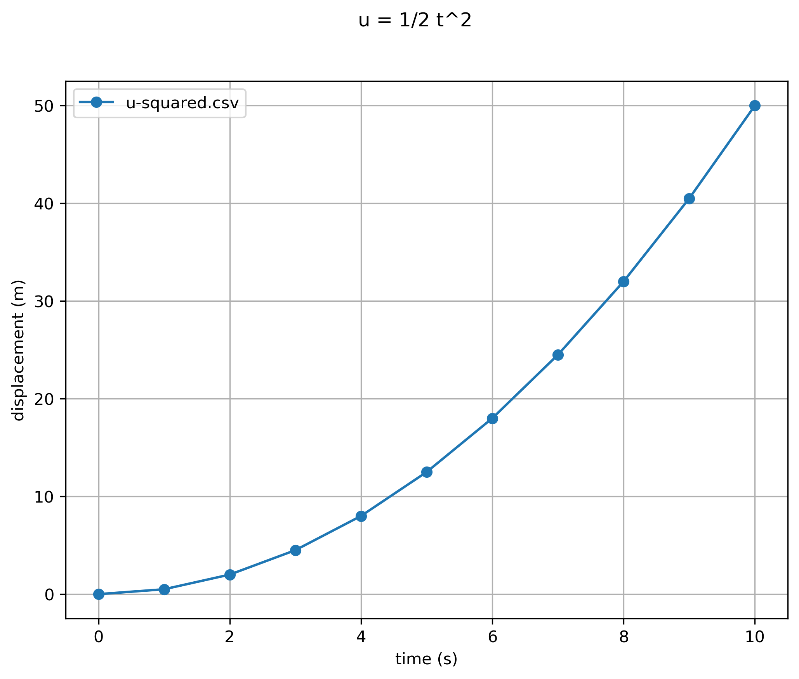
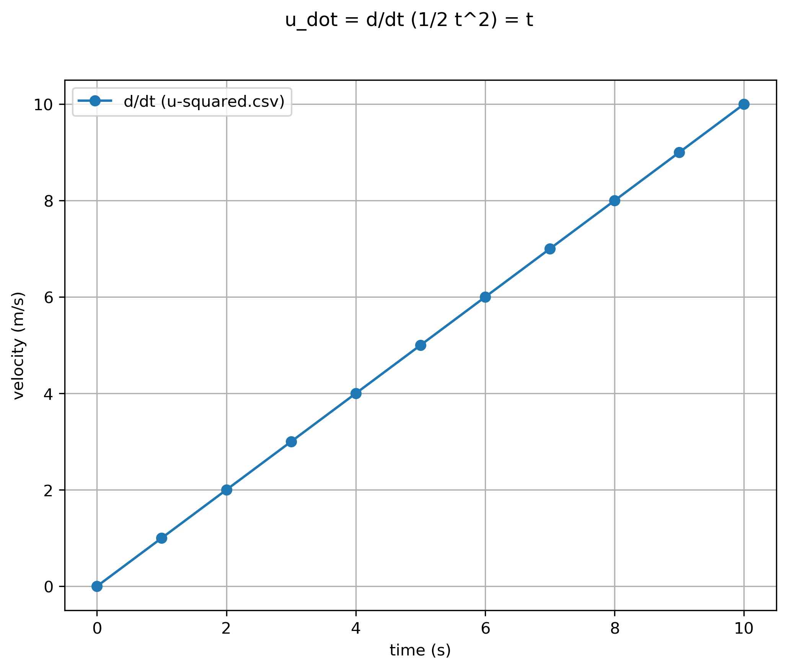
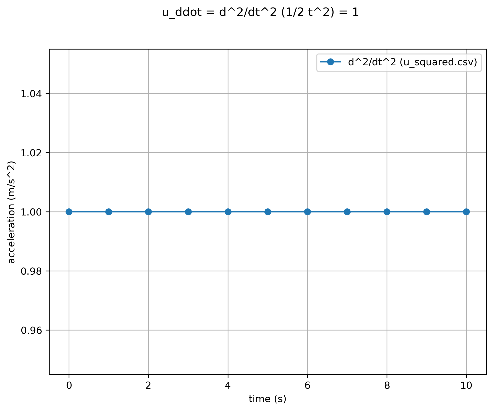
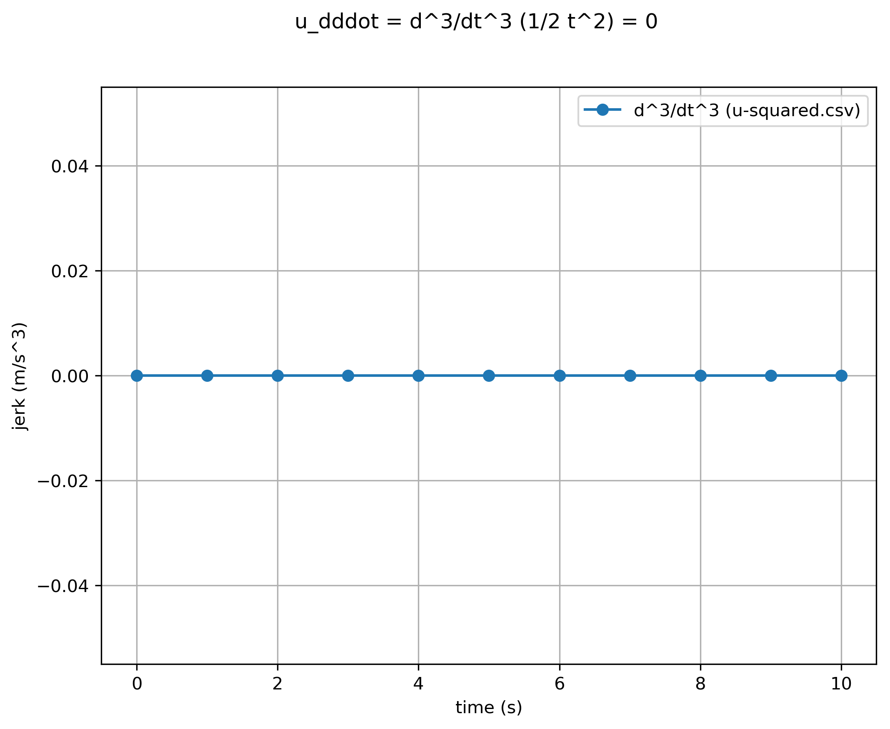

# Differentiation

## Quadratic Function

* source signal with
[u-squared.json](u-squared.json):

* first derivative with
[u-squared-ddt1.json](u-squared-ddt1.json):

* second derivative with
[u-squared-ddt2.json](u-squared-ddt2.json):

* third derivative with
[u-squared-ddt3.json](u-squared-ddt3.json):

## Sine Function

* source signal with
[t_v_sines.json](t_v_sines.json):

* first derivative with
[t_v_sines_ddt1.json](t_v_sines_ddt1.json):

