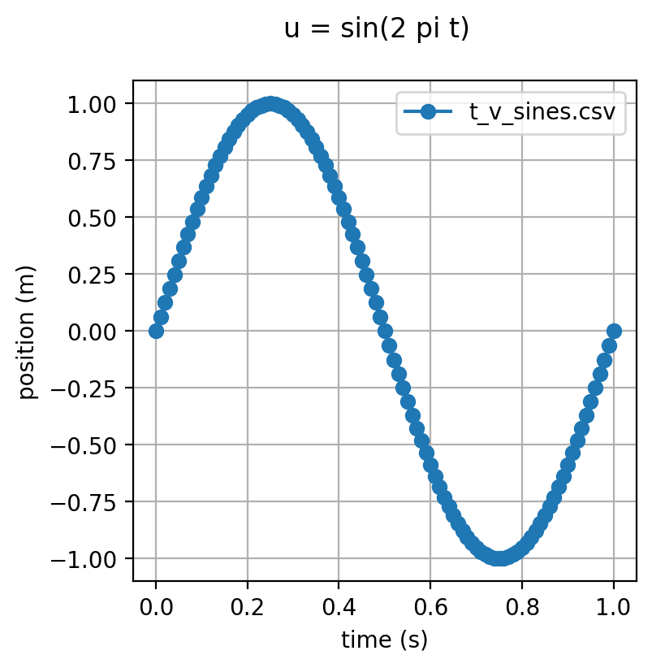
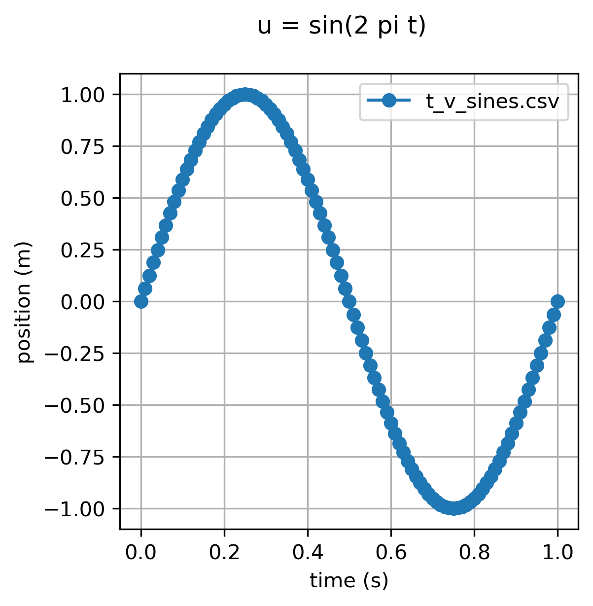
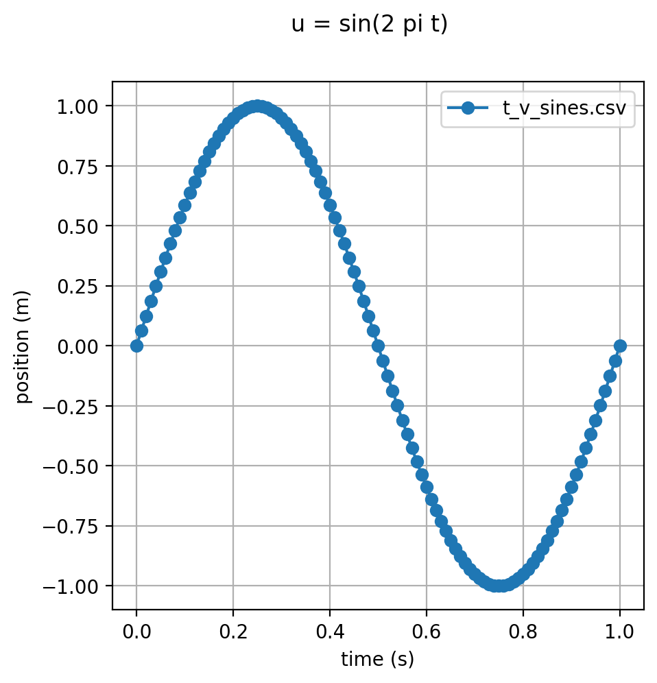
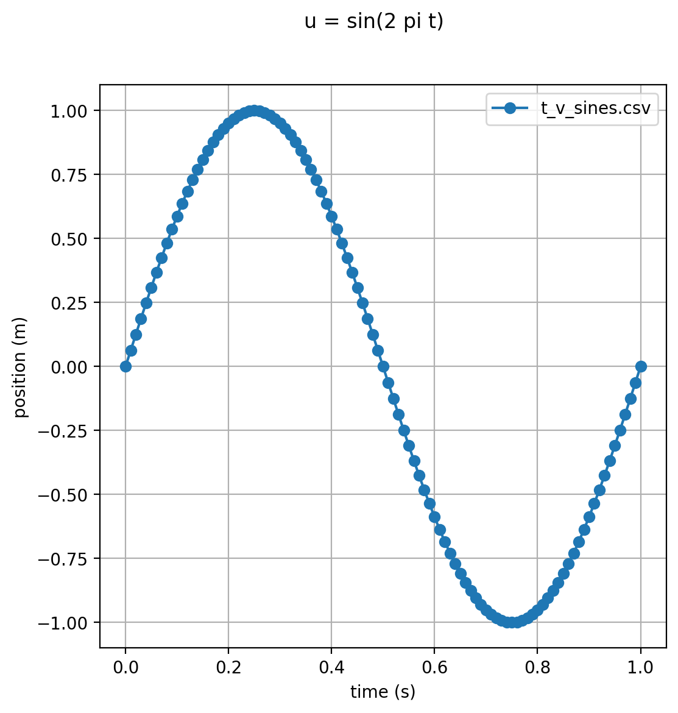
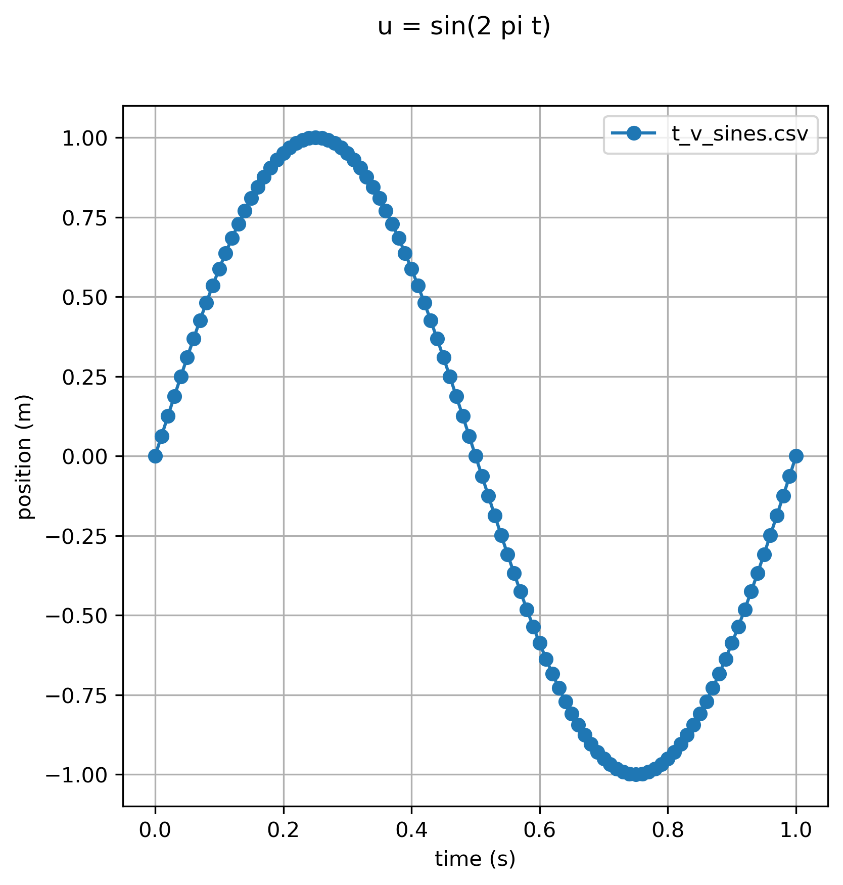

# Figure size versus dpi

* Typical input file: [sines-2-2-200.json](sines-2-2-200.json)

size v dpi        | dpi: 200       | dpi: 300
------------- |:-------------: | :----------:
size: 2.0, 2.0 |  |  
size: 3.0, 3.0 |  |  
size: 4.0, 4.0 |  |  
size: 5.0, 5.0 |  |  
size: 6.0, 6.0 |  |  
